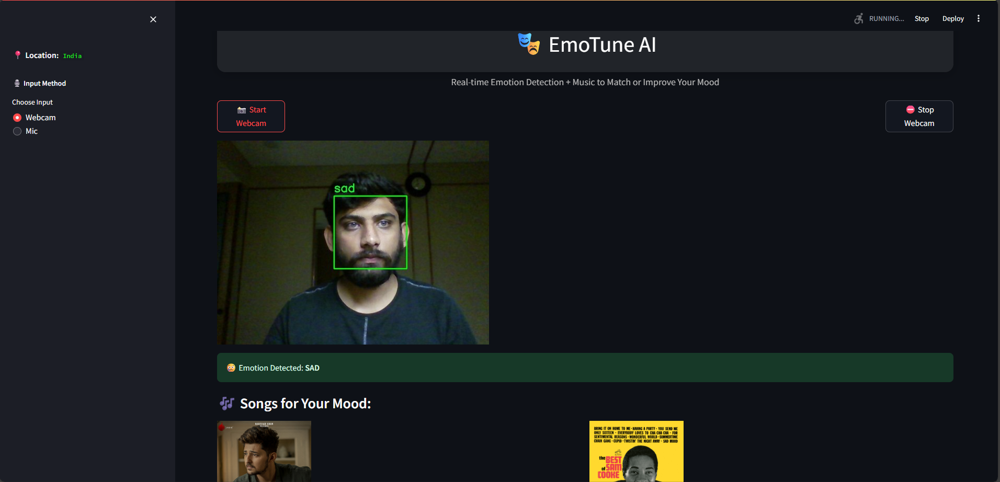
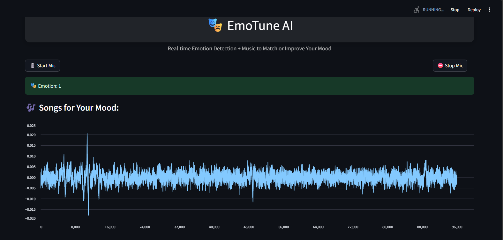
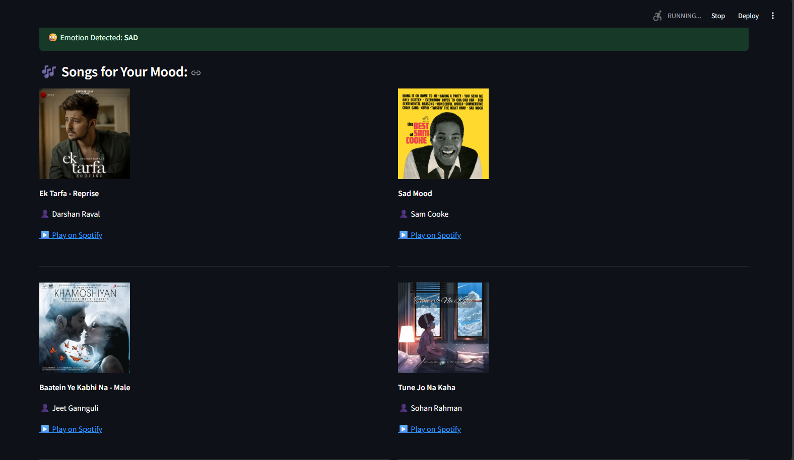

# 🎭 Emotune AI

**Emotune AI** is a multimodal emotion recognition platform that uses your webcam and built-in microphone to detect your current mood in real-time and recommends Spotify songs to match or uplift your emotion.

---

## 🚀 Features

- 🎥 **Facial Emotion Detection** via webcam (real-time feed inside the app)
- 🎤 **Audio Emotion Detection** using mic + waveform animation
- 🌍 **Location-aware music recommendations** (India, US, UK, etc.)
- 🎵 **Spotify API integration** for live preview & play
- 🌃 Light/Dark Mode toggle in sidebar

---

## 🧐 Models Used

- `face_model.h5` → Trained on [FER2013 dataset](https://www.kaggle.com/datasets/msambare/fer2013)
- `audio_model.pkl` → Trained on [TESS dataset](https://tspace.library.utoronto.ca/handle/1807/24487)

---

## 🛠️ Tech Stack

- **Frontend**: Streamlit, HTML/CSS, Plotly, OpenCV
- **Backend**: TensorFlow, scikit-learn, sounddevice, librosa
- **APIs**: Spotify Web API, IP Geolocation API

---

## 📸 Screenshots

### 🖥️ Full App Layout – Main Screen


### 🎥 Real-time Facial Emotion Detection


### 🎤 Live Microphone Waveform & Emotion Detection


### 🎶 Spotify Song Suggestions Based on Mood & Location

---

## 🔧 Setup Instructions

### ✅ 1. Clone this repo
```bash
git clone https://github.com/YOUR_USERNAME/Emotune-AI.git
cd Emotune-AI
